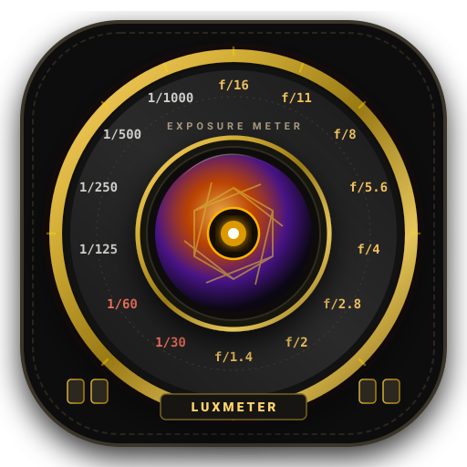
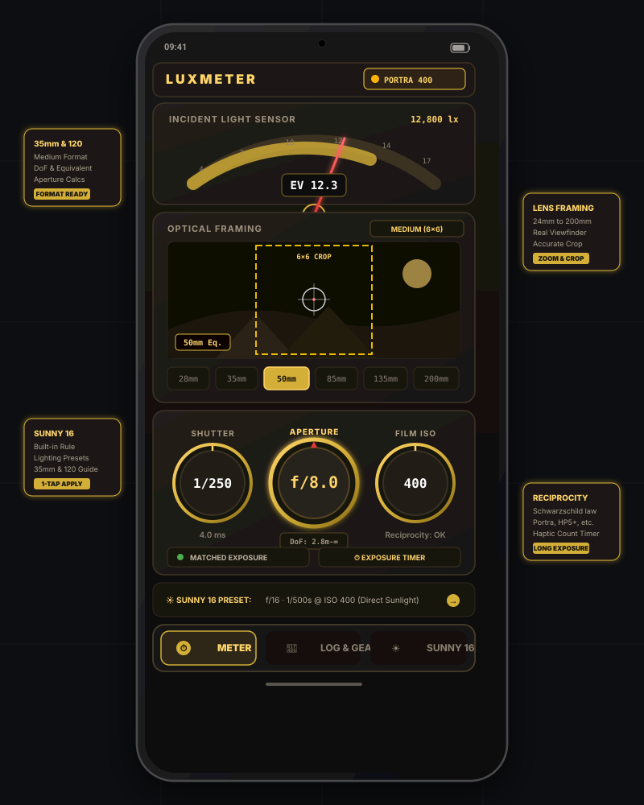

<p align="center">
  
</p>

<h1 align="center">LuxMeter</h1>

<p align="center">
  <strong>Tactile Vintage Analog Film Light Meter & Exposure Companion for Android</strong>
</p>

<p align="center">
  
  
  
  
  
  
</p>

---

## 📸 App Preview

<p align="center">
  
</p>

---

## 📖 Overview

**LuxMeter** is a specialized, tactile light meter and optical viewfinder designed specifically for analog film photographers shooting on **35mm** rangefinders and SLRs, as well as **120 Medium Format** cameras (6×4.5, 6×6, 6×7, 6×9).

Instead of a generic numeric readout, LuxMeter combines **hardware ambient light sensor measurements** and a **live camera optical viewfinder** with classic mechanical brass-and-leatherette rotary dials, galvanometer analog meter needles, and true film reciprocity failure curves.

Whether you are shooting street photos on a Leica M, medium format portraits on a Hasselblad 500C/M or Mamiya RB67, or architectural landscapes on a Pentax 67, LuxMeter ensures every negative is exposed with surgical precision.

---

## ✨ Key Features

### 🔭 1. Viewfinder Framing & Focal Length Simulation (24mm – 200mm)
- **Live Optical Viewfinder**: Preview framing using your phone's camera before taking the shot on your manual film body.
- **Focal Length Selector**: Switch instantly between popular focal lengths (`24mm`, `28mm`, `35mm`, `50mm`, `85mm`, `105mm`, `135mm`, `200mm`).
- **Accurate Crop Frame Lines**: Matches the exact field-of-view of the lens mounted on your analog camera so your metering area matches your final composition.
- **Center Spot Reticle**: Target specific highlights or shadows for precision spot metering.

---

### 🎞️ 2. 35mm vs. 120 Medium Format Engine
- **Format Toggle**: Switch between **35mm Miniature (36×24mm)** and **Medium Format 120 (6×4.5, 6×6, 6×7, 6×9)**.
- **Aperture & Depth of Field (DoF) Equivalence**: Automatically accounts for the larger film gate dimensions and Circle of Confusion (CoC: `0.030mm` for 35mm vs `0.053mm`–`0.060mm` for 120).
  - *Example*: Explains and calculates why an **80mm f/2.8** on a 6×6 medium format camera yields the field of view and depth-of-field look of a **~44mm f/1.5** on 35mm.
- **Hyperfocal Distance & Focus Brackets**: Displays live near/far focus limits based on the selected f-stop and subject distance.

---

### ⏱️ 3. Tactile Mechanical Dials & Galvanometer Gauge
- **Vintage Rotary Dials**: Smooth, haptic-enabled rotatable knobs for:
  - **Aperture**: $f/0.95$ through $f/64$ in full and third stops.
  - **Shutter Speed**: $1/8000\,\text{s}$ through $60\,\text{s}$, plus bulb ($B$) mode.
  - **ISO Film Speed**: ISO 6 through ISO 12,800.
- **Analog Galvanometer Needle**: Classic moving-coil EV meter with balanced match-needle indicators and live incident lux readouts.
- **Priority Metering Modes**: Aperture-priority ($Av$), Shutter-priority ($Tv$), and Manual EV Match modes.

---

### 🧪 4. Reciprocity Failure (Schwarzschild Effect) & Bulb Timer
- **Film Stock Library**: Built-in mathematical reciprocity profiles for beloved film stocks:
  - **Kodak**: Portra 160 / 400 / 800, Tri-X 400, T-Max 100 / 400, Ektar 100, Gold 200.
  - **Ilford**: HP5 Plus 400, FP4 Plus 125, Delta 100 / 400 / 3200, Pan F 50.
  - **Fujifilm**: Provia 100F, Velvia 50 / 100.
  - **CineStill**: 800T, 50D, 400D.
  - **Foma**: Fomapan 100 / 200 / 400.
- **Long Exposure Calculator**: Calculates true required exposure time using film-specific Schwarzschild exponents ($T_{\text{actual}} = T_{\text{metered}}^p$).
- **Integrated Exposure Timer**: Built-in countdown timer with haptic ticks and completion chimes for long exposures and night photography.

---

### ☀️ 5. Interactive "Sunny 16" Rule Cheat Sheet & Calculator
- **Dedicated Bottom Tab**: Instant access to the golden rule of outdoor exposure.
- **Weather Condition Presets**:
  - ❄️ **Snow / Beach Sand** ($f/22$) — EV 16
  - ☀️ **Direct Overhead Sunlight** ($f/16$) — EV 15
  - ⛅ **Slightly Overcast / Hazy Sun** ($f/11$) — EV 14
  - ☁️ **Overcast / Soft Daylight** ($f/8$) — EV 13
  - 🌲 **Heavy Overcast / Open Shade** ($f/5.6$) — EV 12
  - 🌅 **Deep Shade / Sunset Glow** ($f/4$) — EV 11
- **Interactive ISO Slider**: Auto-computes shutter speed ($1/\text{ISO}$) and secondary reciprocal exposure pairs.
- **35mm vs 120 Format Guidance**: Deep dive into film latitude differences (e.g., exposing color negative for the shadows at $+1$ EV vs. tight $\pm 0.5$ EV slide film latitude).
- **"Apply to Meter" Button**: 1-tap synchronization transfers calculated Sunny 16 settings straight to the main meter dials.

---

### 📒 6. Film Roll Log & Shot Tracker
- **Log Exposure Data**: Record shutter speed, aperture, EV, location, camera body, lens, and shooting notes for each shot on your roll.
- **Roll Tracking**: Monitor remaining frames on 36-exposure (35mm) or 12/16-exposure (120) rolls.
- **Local Persistence**: Powered by SQLite & Room Database — keeps your notes safe completely offline without requiring an account.

---

### 📱 7. Responsive & Foldable Phone Support
- **Adaptive Layouts**: Full support for standard smartphones, compact devices, and **foldable devices / tablets** ($\ge 600\,\text{dp}$).
- **Dual-Pane View**: On foldables and tablets, view the optical viewfinder and analog meter dials side-by-side without scrolling.

---

## 🚀 Getting Started

### System Requirements
- **Android OS**: Android 8.0 (API Level 26) or higher.
- **Permissions**:
  - `CAMERA`: Used strictly for real-time framing simulation in the viewfinder (no photos are saved or uploaded).
  - `VIBRATE`: Provides mechanical haptic feedback when turning dials and timer notifications.
  - Ambient Light Sensor: Built-in hardware sensor (uses automatic fallback to camera analysis if light sensor is absent).

### Quick Start Guide
1. **Choose Your Film**: Tap the film stock pill in the top header (e.g., *Kodak Portra 400*) to set your ISO and reciprocity profile.
2. **Select Format & Lens**: Toggle between **35mm** and **120 Medium Format**, then select your lens focal length (e.g., `50mm` or `80mm`).
3. **Meter the Scene**: Point your phone's sensor toward the scene. Read the analog EV needle or check the viewfinder frame.
4. **Dial in Exposure**: Adjust the Aperture or Shutter dial until the needle aligns with the match-center target.
5. **Check Sunny 16**: If in doubt under sunlight, switch to the **SUNNY 16** tab for an instant reality check and reciprocal pair chart!

---

## 🛠️ Tech Stack & Architecture

LuxMeter is architected following modern Android and Kotlin best practices:

- **UI Toolkit**: [Jetpack Compose](https://developer.android.com/jetpack/compose) with Material Design 3 (M3).
- **Architecture**: MVVM (Model-View-ViewModel) + Clean Architecture repository pattern.
- **State Handling**: Kotlin Coroutines, `StateFlow`, `collectAsStateWithLifecycle`.
- **Local Persistence**: [Room Database](https://developer.android.com/training/data-storage/room) with SQLite.
- **Camera Integration**: Android CameraX preview with custom aspect ratio frame crops.
- **Sensors & Haptics**: Android `SensorManager` (TYPE_LIGHT) and `Vibrator` / `HapticFeedbackConstants`.
- **Build System**: Gradle with Kotlin DSL (`build.gradle.kts`).

```
com.example/
├── data/
│   ├── dao/                 # Room DAOs for shot logs & rolls
│   ├── model/               # FilmStock, CameraFormat, ExposureLog models
│   └── repository/          # Repository implementations
├── sensor/
│   ├── DepthOfFieldCalculator.kt  # Circle of confusion, hyperfocal, DoF
│   ├── ExposureCalculator.kt      # EV100, lux conversion, Schwarzschild law
│   ├── HapticManager.kt           # Mechanical tactile tick haptics
│   └── LightSensorManager.kt      # Hardware lux sensor lifecycle
├── ui/
│   ├── components/          # VintageDial, AnalogMeterGauge, CameraViewfinder, etc.
│   ├── meter/               # LightMeterScreen & LightMeterViewModel
│   ├── settings/            # SettingsAndLogScreen & Roll Manager
│   ├── sunny16/             # Sunny16GuideScreen & Calculator
│   └── theme/               # Vintage brass, slate & amber color scheme
└── MainActivity.kt          # Edge-to-edge entry point
```

---

## 🤝 Contributing

We welcome contributions from photographers, Android engineers, and film lovers alike! Whether you want to add new film stock reciprocity curves, expand medium format frame options (e.g., 6×12 or 6×17 panoramic), or optimize performance, here is how you can help:

### 1. Development Setup
1. **Clone the Repository**:
   ```bash
   git clone https://github.com/your-username/luxmeter.git
   cd luxmeter
   ```
2. **Open in Android Studio**:
   - Open Android Studio (Ladybug / Hedgehog or newer recommended).
   - Ensure JDK 17+ is configured in `Gradle Settings`.
3. **Build the Project**:
   ```bash
   gradle assembleDebug
   ```
4. **Run Unit Tests**:
   ```bash
   gradle :app:testDebugUnitTest
   ```

### 2. How to Contribute
- **Add New Film Stocks**:
  - Open `app/src/main/java/com/example/data/model/FilmStock.kt`.
  - Add your stock with ISO rating, reciprocity factor $p$, and official datasheet compensation formulas.
- **Add Camera Formats or Frame Lines**:
  - Open `app/src/main/java/com/example/data/model/CameraFormat.kt` and `CameraViewfinder.kt`.
  - Add the format dimensions (e.g., 6×17 panoramic with aspect ratio $3:1$).
- **UI & Accessibility Enhancements**:
  - Ensure all new components maintain a minimum 48dp touch target and support TalkBack content descriptions.
  - Test layouts in both portrait and foldable landscape ($\ge 600\,\text{dp}$).

### 3. Contribution Workflow
1. Fork the project.
2. Create your feature branch:
   ```bash
   git checkout -b feature/new-film-stock-tmax3200
   ```
3. Commit your changes with clear, semantic commit messages:
   ```bash
   git commit -m "feat(film): add Kodak T-Max P3200 reciprocity profile"
   ```
4. Push to your branch:
   ```bash
   git push origin feature/new-film-stock-tmax3200
   ```
5. Open a Pull Request detailing your changes and references (e.g., film data sheets or test results).

---

## 📄 License

LuxMeter is distributed under the **MIT License**. See [LICENSE](LICENSE) for details.

---

<p align="center">
  Crafted with passion for the analog film community. Happy shooting! 🎞️✨
</p>
